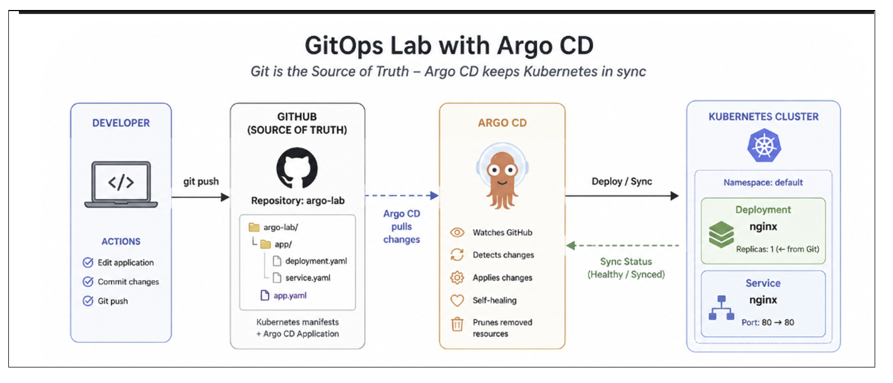
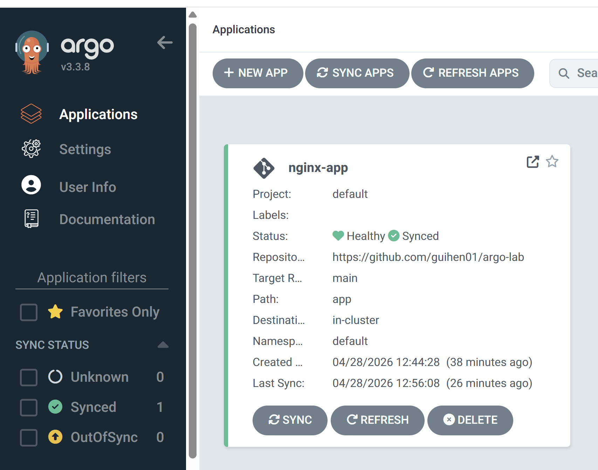
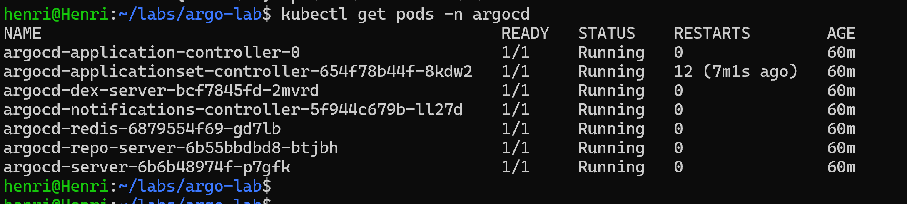

# 🚀 Kubernetes GitOps Lab — Argo CD

## 📌 Overview

This project demonstrates a **GitOps workflow** using:

* Kubernetes (k3d / minikube)
* Argo CD
* GitHub as the single source of truth

👉 The application is deployed **automatically from Git** — no manual `kubectl apply` after initial setup.

---

## 📊 Argo CD Dashboard





## 🧠 GitOps Concept

```text
Developer → Git Push → GitHub → Argo CD → Kubernetes
```

* Git = Source of Truth
* Argo CD = Deployment Engine
* Kubernetes = Execution Environment

---

## 🏗️ Architecture

```text
Local Machine → GitHub Repo → Argo CD → Kubernetes Cluster
```

---

## 🔍 Verification



--

## 📁 Project Structure

```text
argo-lab/
├── app/
│   ├── deployment.yaml
│   └── service.yaml
└── app.yaml
```

* `app/` → Kubernetes manifests
* `app.yaml` → Argo CD application definition

---

## ⚙️ Prerequisites

* Kubernetes cluster (k3d, minikube, etc.)
* kubectl installed
* Docker running
* Git installed
* GitHub account

---

## 🚀 Setup Instructions

### 1. Install Argo CD

```bash
kubectl create namespace argocd

kubectl apply -n argocd \
-f https://raw.githubusercontent.com/argoproj/argo-cd/stable/manifests/install.yaml
```

---

### 2. Access Argo CD UI

```bash
kubectl port-forward svc/argocd-server -n argocd 8080:443
```

👉 Open: https://localhost:8080

Get admin password:

```bash
kubectl get secret argocd-initial-admin-secret \
-n argocd -o jsonpath="{.data.password}" | base64 --decode
```

Login:

* user: `admin`
* password: (above)

---

### 3. Deploy the Application

```bash
kubectl apply -f app.yaml
```

---

### 4. Verify Deployment

```bash
kubectl get pods
```

Expected:

```text
nginx-xxxxx   Running
```

---

## 🔁 GitOps in Action (Key Test)

### Modify the app

```yaml
replicas: 1 → replicas: 3
```

### Push changes

```bash
git add .
git commit -m "scale app"
git push
```

### Result

```bash
kubectl get pods
```

👉 3 pods created automatically
👉 No kubectl apply needed

---

## ⚙️ Argo CD Configuration

```yaml
syncPolicy:
  automated:
    prune: true
    selfHeal: true
```

* **Automated Sync** → deploys changes automatically
* **Prune** → removes deleted resources
* **Self-Heal** → reverts manual changes in cluster

---

## ⚠️ Important Rules (GitOps)

| Action                  | Result       |
| ----------------------- | ------------ |
| Modify local only       | ❌ No effect  |
| Modify + git push       | ✅ Deployment |
| Modify cluster manually | ❌ Reverted   |

---

## 🔥 Key Learnings

* Git is the **single source of truth**
* Argo CD continuously enforces desired state
* Kubernetes should not be modified manually
* Full Git-driven deployment lifecycle

---

## 🚀 Next Steps

* Add a custom application (Python / Go)
* Integrate Prometheus & Grafana
* Use Helm charts with Argo CD
* Implement webhook-based sync

---

## 💡 Author

**Henri Guillot**
Cloud & Network Engineer

---

## ⭐ Why this project matters

This lab demonstrates real-world:

* GitOps workflow
* Infrastructure as Code mindset
* Cloud-native deployment practices

👉 Highly relevant for Cloud / DevOps / Kubernetes roles
